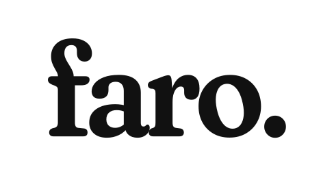

<h1 align="center"></h1>
<p align="center">Un panel autoalojado para los servidores de tu homelab.<br>
<b>Sin dependencias. Sin puertos abiertos en tus máquinas. Un solo fichero de configuración.</b><br>
<a href="README.md">English</a></p>

<p align="center"></p>

faro muestra en una sola pantalla todos los servidores y servicios de tu casa: CPU,
temperaturas, memoria y red en directo, discos con su salud SMART, pools ZFS,
máquinas virtuales y contenedores de Proxmox, copias de seguridad y si cada una de
tus apps responde. Te avisa en el móvil cuando algo falla y puede encender y apagar VMs.

Nació como el panel de mi propio homelab (dos servidores Proxmox y unos veinte
servicios) y lo he convertido en algo que cualquiera puede desplegar.

## Qué lo hace distinto

- **Agentes sin puertos abiertos.** faro entra en cada máquina por SSH con una clave
  que `authorized_keys` limita a un único comando, el agente. Con esa clave no se
  puede abrir una shell, redirigir puertos ni ejecutar otra cosa.
- **Cero dependencias.** Servidor y agente usan solo la biblioteca estándar de Python.
  El agente funciona desde Python 3.7.
- **Añadir un servidor es un comando:** `faro add-host root@192.168.1.20` instala el
  agente, restringe la clave, lo prueba y lo añade a la configuración.
- **Un fichero legible** (`faro.toml`) que se recarga solo. Las claves pueden ir en
  variables de entorno o en ficheros aparte.
- **Detecta lo que tiene cada máquina.** Docker en una Raspberry, invitados y copias
  en un Proxmox, ZFS y SMART en un NAS.
- **Pensado para el móvil:** se instala como app (PWA), en tema claro u oscuro, y el
  fondo cambia con la hora del día.

## Pruébalo en 10 segundos

```sh
git clone https://github.com/njuante/faro && cd faro
python3 -m faro demo --language es     # abre http://localhost:8080
```

## Instalación

```sh
curl -fsSL https://raw.githubusercontent.com/njuante/faro/main/deploy/install.sh | sudo sh
faro add-host root@192.168.1.20 --name nas
```

La configuración está en `/etc/faro/faro.toml` (con todas las opciones comentadas
en [`faro.example.toml`](faro.example.toml)). Hay más documentación, en inglés, en
[docs/](docs/).

## Licencia

[MIT](LICENSE).
