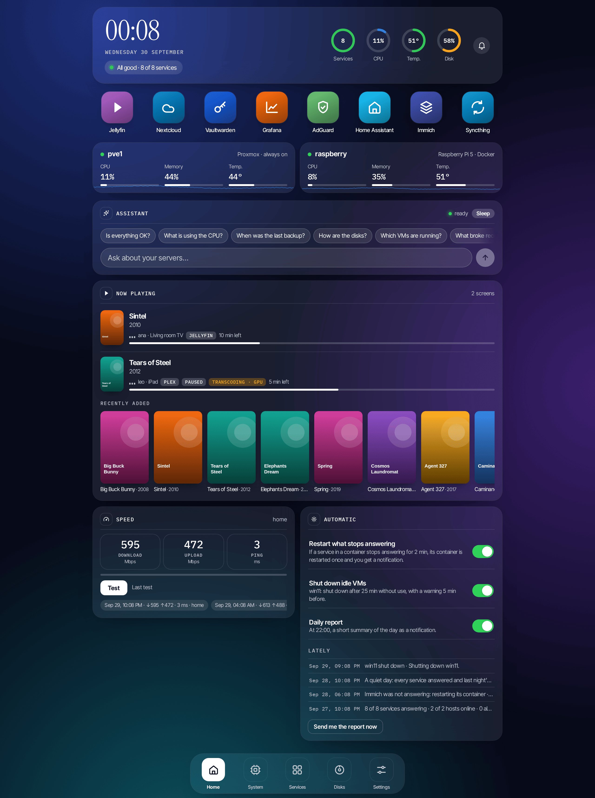
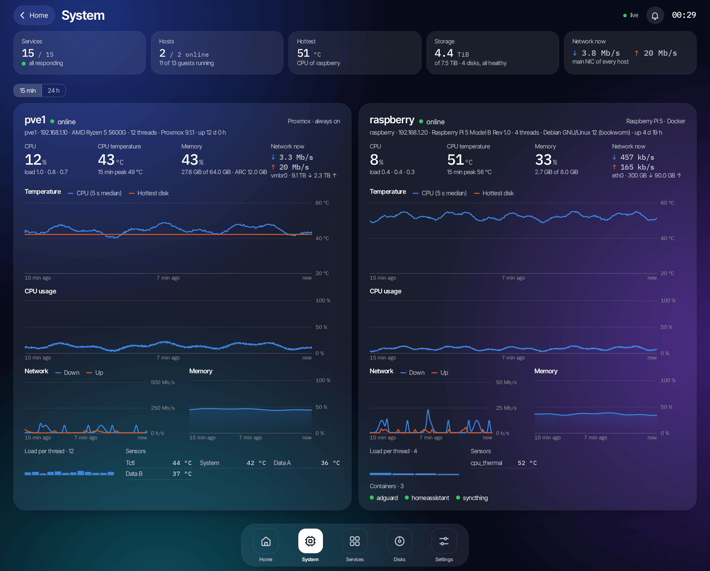
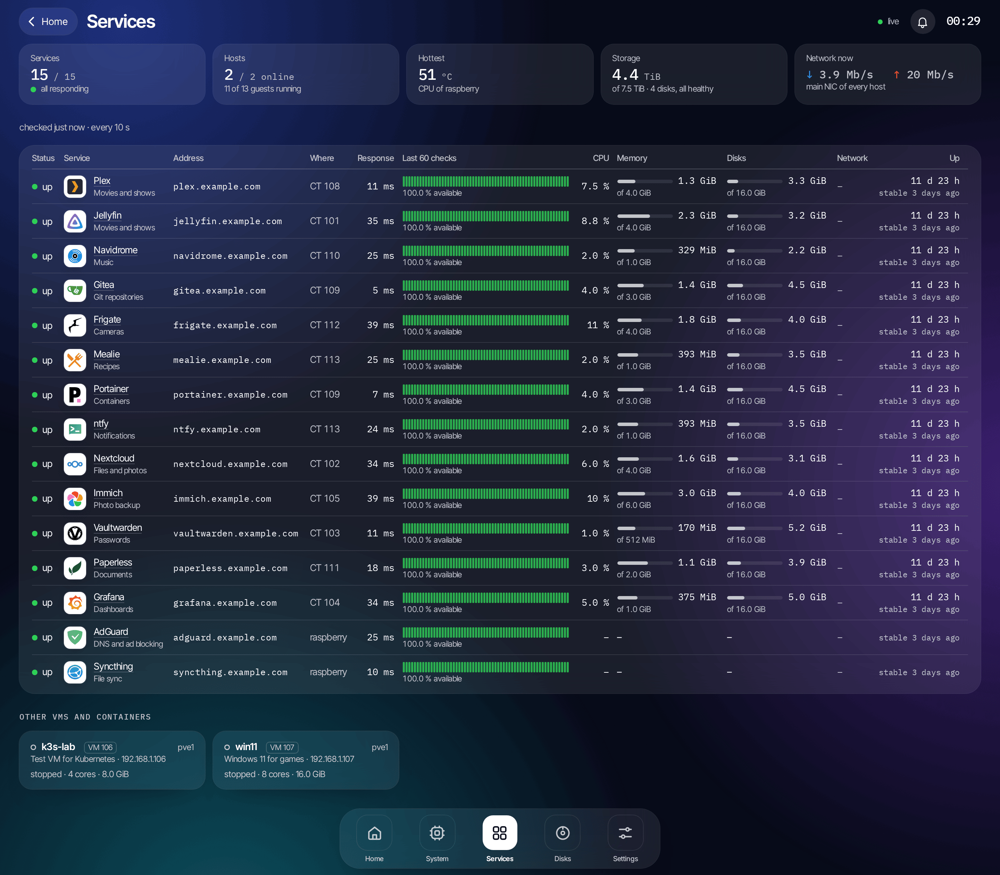
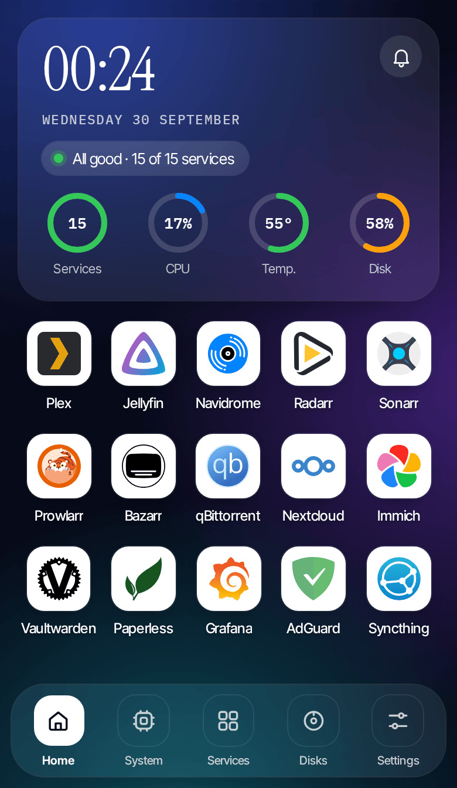
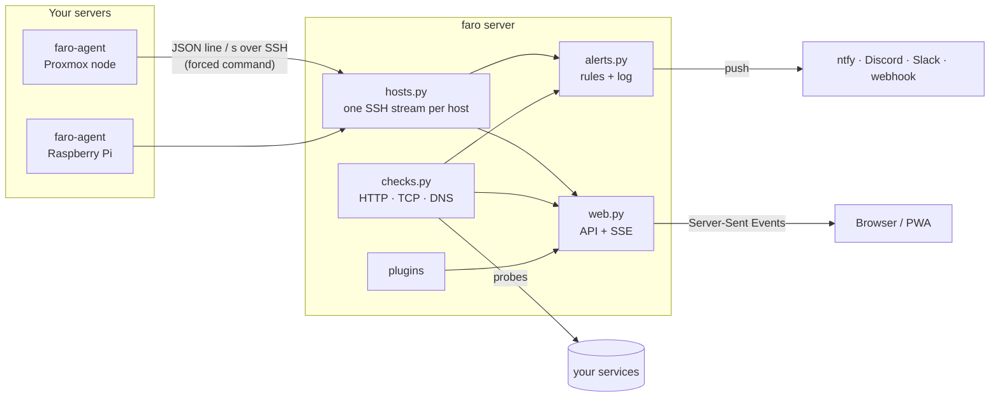

<p align="center">
  
</p>

<h1 align="center">faro</h1>

<p align="center">
  A self-hosted dashboard for your homelab servers.<br>
  <b>No dependencies. No open ports on your hosts. One config file.</b>
</p>

<p align="center">
  <a href="../../actions/workflows/ci.yml"></a>
  
  
  
  · <a href="README.es.md">Español</a>
</p>

<p align="center">
  
</p>

faro shows every server and service in your homelab on one screen: live CPU,
temperatures, memory, network, disks with SMART health, ZFS pools, Proxmox VMs
and containers, backups, and whether each of your apps is answering. It warns
you on your phone when something breaks and can switch VMs on and off.

It started as the panel of my own homelab (two Proxmox servers and ~20 services)
and grew into something anyone can deploy.

| System | Services | On a phone |
|---|---|---|
|  |  |  |

## Why another dashboard?

- **Agents that open no ports.** faro connects to each host over SSH with a key
  that `authorized_keys` pins to a single command, the agent. That key can't open
  a shell, forward ports or run anything else. Nothing listens on your hosts.
- **Zero dependencies.** Server and agent use only the Python standard library.
  No `pip install`, no Node, no database. The agent runs on Python 3.7+, so it
  works on old boxes too.
- **Adding a server takes one command.** `faro add-host root@192.168.1.20` installs
  the agent, restricts the key, tests it and adds the host to the config.
- **One readable config file.** Services, hosts, alerts and plugins all live in
  `faro.toml`, and a running faro reloads it by itself. Secrets can stay in
  environment variables or files.
- **Detects what each host has.** A Raspberry Pi shows its Docker containers, a
  Proxmox node its guests, storages and backups, a NAS its ZFS pools and SMART data.
  There's nothing to switch on.
- **A local AI assistant** (optional). Ask "what is using the CPU?" or "when was
  the last backup?" and a model running on your own hardware answers from the live data.
  It can call read-only tools that faro and its plugins provide
  ([docs/assistant.md](docs/assistant.md)).
- **Plugins for what you run**: power buttons for Proxmox guests, and *now
  playing* and *recently added* from Jellyfin, Plex and Navidrome
  ([docs/plugins.md](docs/plugins.md#built-in-plugins)).
- **Built for a phone.** It installs as an app (PWA), works in light and dark
  mode, and follows the time of day.

## Try it in 10 seconds

```sh
git clone https://github.com/njuante/faro && cd faro
python3 -m faro demo          # open http://localhost:8080
```

Demo mode makes up two servers and eight services. You don't need a config file or any servers.

## Install

On a Debian/Ubuntu machine or LXC container:

```sh
curl -fsSL https://raw.githubusercontent.com/njuante/faro/main/deploy/install.sh | sudo sh
```

The script creates a `faro` system user and a hardened systemd service. It asks for a
password and starts faro on port 8080, already monitoring the machine it runs on.
Then add your servers:

```sh
faro add-host root@192.168.1.20 --name nas
faro add-host root@192.168.1.30 --name pi --description "Raspberry Pi · Docker"
```

Docker works too. See [`compose.yml`](compose.yml).

## Configure

```toml
# /etc/faro/faro.toml
title = "Homelab"

[[services]]
name = "Jellyfin"
url = "https://jellyfin.example.com"
icon = "play"
host = "nas"
guest = 101                 # Proxmox CT: its CPU and RAM show next to the service

[[services]]
name = "AdGuard DNS"
check = "dns"               # http (default), tcp, dns or none
target = "192.168.1.53"

[notify.ntfy]
url = "https://ntfy.sh"
topic = "my-homelab-8f3k2"
token = "env:FARO_NTFY_TOKEN"
```

The rest of the options are in [`faro.example.toml`](faro.example.toml) and
[docs/configuration.md](docs/configuration.md).

## How it works



- The **agent** (`agent/faro-agent.py`, one file) reads `/proc`, `/sys`,
  `lsblk`, `smartctl`, `zpool`, `pvesh` and `docker` when they exist, and prints
  one JSON line per second. The fast metrics are read every second, guests every
  5 s and disks every minute.
- The **server** keeps 15 minutes of per-second history and 24 hours of per-minute
  averages per host (saved to disk), probes the services in parallel and streams
  updates to the browser with Server-Sent Events.
- **Alerts** only fire once a problem has lasted long enough, with hysteresis so
  they don't flap. They send a second message when the problem clears, and every
  alert is kept for the bell in the UI.
- **Plugins** add actions (buttons), home cards and API routes. See
  [docs/plugins.md](docs/plugins.md). Your private plugins can live in
  `/etc/faro/plugins/` and never have to be in this repository.

More detail: [docs/architecture.md](docs/architecture.md).

## Security

- A password login (PBKDF2-SHA256, 600k iterations) with HttpOnly, SameSite=Strict
  session cookies. Sessions are stored hashed and login is rate-limited per IP.
- Every state-changing request needs a custom header, so a cross-site form
  can't trigger an action (CSRF). Strict CSP, `X-Frame-Options: DENY`, `nosniff`.
- The browser never sees tokens, password hashes or SSH details: the API sends a
  filtered view of the config.
- The systemd unit runs as an unprivileged user with `ProtectSystem=strict`,
  `NoNewPrivileges` and friends.
- Proxmox power buttons use an API token that only has `VM.PowerMgmt`
  ([docs/proxmox.md](docs/proxmox.md)).

## Development

```sh
python3 -m unittest discover -s tests -t .     # 39 tests, no pip install
python3 -m faro demo --language es
```

CI runs [ruff](https://docs.astral.sh/ruff/), the tests on Python 3.11–3.13, the
agent on 3.8–3.10 and a Docker build with a smoke test.

## Roadmap

- [ ] Edit services from the UI (it writes `faro.toml` for you)
- [ ] Push mode for hosts behind NAT (the agent connects out over HTTPS)
- [ ] Prometheus `/metrics` endpoint

## License

[MIT](LICENSE). Fonts under the [SIL Open Font License](web/fonts/OFL.txt).
